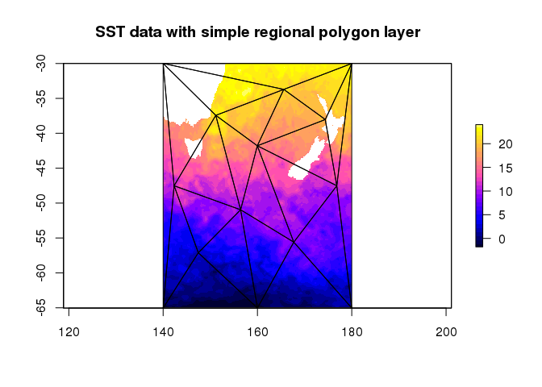
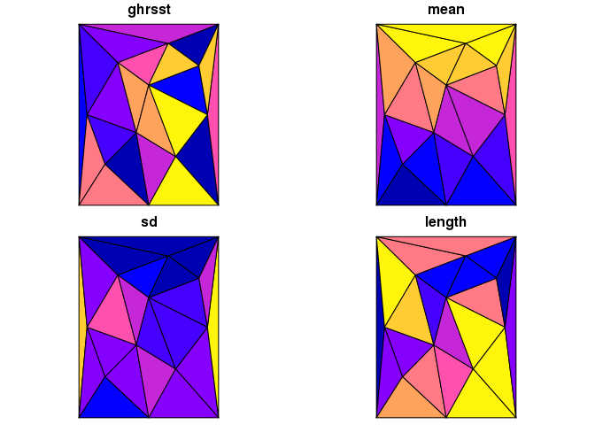
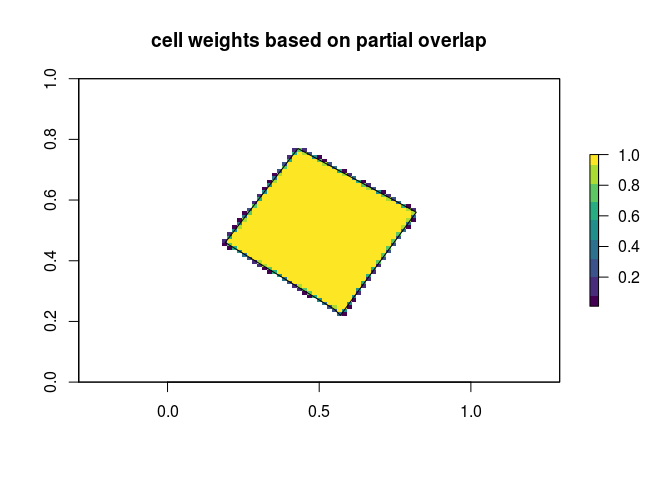
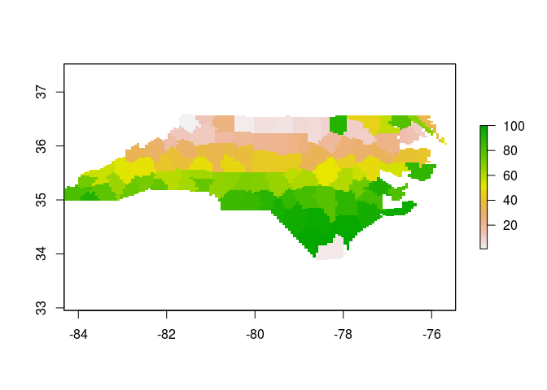

[](https://travis-ci.org/r-gris/tabularaster) [](https://ci.appveyor.com/project/r-gris/tabularaster) [](https://codecov.io/github/r-gris/tabularaster?branch=master)

<!-- README.md is generated from README.Rmd. Please edit that file -->
tabularaster
============

The `raster` package is extremely powerful in the R ecosystem for spatial data. It can be used very efficiently to drive data extraction and summary tools using its consistent cell-index and comprehensive helper functions for converting between cell values and less abstract raster grid properties.

Tabularaster provides some more helpers for working with cells and tries to fill some of the (very few!) gaps in raster functionality. When raster returns cell values of hierarchical objects it returns a hierarchical (list) of cells to match the input query.

Tabularaster provides:

-   extraction of cells as a simple data frame with "object ID" and "cell index"
-   `as_tibble` for raster data, with options for value column and cell, dimension and date indexing
-   workers to bring `sf` support to `raster`

There is some overlap with `quadmesh` and `spex` while I figure out where things belong.

Installation
============

Tabularaster is currently only available from Github, and it's early days so please use with caution. There are some things that I might need to change.

``` r
devtools::install_github("r-gris/tabularaster")
```

Usage
=====

Extract the cell numbers of raster `r` that are co-located with object `q`. (The argument names are `x` and `query`).

``` r
cellnumbers(r, q)
```

In the above example, `r` is any *raster* object and `q` is another spatial object, used as a query. Cell numbers can be extracted from any raster object, any of a `raster::raster`, `raster::stack` or `raster::brick`. It's not really relevant what that object contains, as only the *dimensions* (number of cells in x and y) and the *extent* (geographic range in x and y) determine the result. The `r` object can actually not contain any data - this is a very powerful but seemingly under-used feature of the `raster` package.

The object `q` may be any of `sf`, `sp` layer types or a matrix of raw coordinates (x-y). ('Exotic' `sf` types like GEOMETRYCOLLECTION or POLYHEDRALSURFACE, and mixed-topology layers are not yet supported - let me know if you really need this and we'll make it work.)

Simple examples
===============

In straightforward usage, `cellnumbers` returns a tibble with `object_` to identify the spatial object by number, and `cell_` which is specific to the raster object, a function of its `extent`, `dim`ensions and `projection` (crs - coordinate reference system).

``` r
library(raster)
#> Loading required package: sp
library(tabularaster)
(r <- raster(volcano))
#> class       : RasterLayer 
#> dimensions  : 87, 61, 5307  (nrow, ncol, ncell)
#> resolution  : 0.01639344, 0.01149425  (x, y)
#> extent      : 0, 1, 0, 1  (xmin, xmax, ymin, ymax)
#> coord. ref. : NA 
#> data source : in memory
#> names       : layer 
#> values      : 94, 195  (min, max)
(cell <- cellnumbers(r, cbind(0.5, 0.5)))
#> Warning: projections not the same 
#>     x: NA
#> query: NA
#> # A tibble: 1 x 2
#>   object_ cell_
#>     <int> <dbl>
#> 1       1  2654
```

This cell number query can be then be used to drive other raster functions, like `extract` and `xyFromCell` and many others.

``` r
xyFromCell(r, cell$cell_)
#>        x   y
#> [1,] 0.5 0.5


raster::extract(r, cell$cell_)
#>     
#> 161
```

This is an extremely efficient way to drive extractions from raster objects, for performing the same query from multiple layers at different times. It's also very useful for using `dplyr` to derive summaries, rather than juggling lists of extracted values, or different parts of raster objects.

as tibble
---------

There is an `as_tibble` method with options for cell, dimension, and date.

``` r
library(dplyr)
#> 
#> Attaching package: 'dplyr'
#> The following objects are masked from 'package:raster':
#> 
#>     intersect, select, union
#> The following objects are masked from 'package:stats':
#> 
#>     filter, lag
#> The following objects are masked from 'package:base':
#> 
#>     intersect, setdiff, setequal, union
as_tibble(r)
#> # A tibble: 5,307 x 2
#>    cellvalue cellindex
#>        <dbl>     <int>
#>  1       100         1
#>  2       100         2
#>  3       101         3
#>  4       101         4
#>  5       101         5
#>  6       101         6
#>  7       101         7
#>  8       100         8
#>  9       100         9
#> 10       100        10
#> # ... with 5,297 more rows
b <- brick(r, r*2)
as_tibble(b)
#> # A tibble: 10,614 x 3
#>    cellvalue cellindex dimindex
#>        <dbl>     <int>    <int>
#>  1       100         1        1
#>  2       100         2        1
#>  3       101         3        1
#>  4       101         4        1
#>  5       101         5        1
#>  6       101         6        1
#>  7       101         7        1
#>  8       100         8        1
#>  9       100         9        1
#> 10       100        10        1
#> # ... with 10,604 more rows
as_tibble(b, cell = FALSE) %>% arrange(desc(dimindex)) ## leave out the cell index
#> # A tibble: 10,614 x 2
#>    cellvalue dimindex
#>        <dbl>    <int>
#>  1       200        2
#>  2       200        2
#>  3       202        2
#>  4       202        2
#>  5       202        2
#>  6       202        2
#>  7       202        2
#>  8       200        2
#>  9       200        2
#> 10       200        2
#> # ... with 10,604 more rows
```

The date or date-time is used as the dimension index if present.

``` r
btime <- setZ(b, Sys.time() + c(1, 10))
as_tibble(btime) %>% group_by(dimindex) %>% summarize(n = n())
#> # A tibble: 2 x 2
#>              dimindex     n
#>                <dttm> <int>
#> 1 2017-06-14 22:46:58  5307
#> 2 2017-06-14 22:47:07  5307

as_tibble(btime, split_date = TRUE)
#> # A tibble: 10,614 x 5
#>    cellvalue cellindex  year month   day
#>        <dbl>     <int> <int> <int> <int>
#>  1       100         1  2017     6    14
#>  2       100         2  2017     6    14
#>  3       101         3  2017     6    14
#>  4       101         4  2017     6    14
#>  5       101         5  2017     6    14
#>  6       101         6  2017     6    14
#>  7       101         7  2017     6    14
#>  8       100         8  2017     6    14
#>  9       100         9  2017     6    14
#> 10       100        10  2017     6    14
#> # ... with 10,604 more rows
```

Warnings
========

1.  I tend to end up using `tidyr::extract` and `raster::extract`, `dplyr::select` and `raster::select` as I always use these packages together.
2.  `cellnumbers` doesn't currently reproject the second argument `query`, even when would make sense to do so like `extract` does. This is purely to reduce the required dependencies.
3.  There's no formal link between the cell number values and the raster object itself. I use this "loose coupling" so extensively that I have developed habits that tend to make it pretty robust. Please use with caution, you can easily get incorrect answers by asking a different raster a question based on the wrong cell numbers.

If you find that things don't work, first check if it's a namespace problem, there are a few function name overlaps in the `tidyverse` and `raster`, and in R generally. There is no way to fix this properly atm.

Tabularaster doesn't reproject on the fly, but it will tell you if the CRS (projection metadata) of the two objects is not the same, or if either or both are NA. I'd like a light-weight reprojection engine in order to do this, and `proj4` is a candidate that I've explored enough to use but a modern, trim PROJ.4 interface for R in its own package is something I think we need.

Ultimately the cell index vector should probably be a formal class, with knowledge of its extent and grain. I'd love this to be formalized, but I seem to not have the design expertise required to get the system right. It's something that `ggplot2` needs, but there aren't any existing examples in R anywhere as far as I can tell. The [stars project](https://github.com/edzer/stars) is a good place to see what else is happening in this space in R. Other examples are the unfinshed `tbl_cube` in `dplyr`, the R6 objects in `velox`, and the mesh indexing used by packages `rgl`, `Vcg`, `icosa`, `dggridR`, `deldir`, `geometry`, `RTriangle`, `TBA`, (and there are many others).

If you are interested in these issues please get in touch, use the [Issues tab](https://github.com/r-gris/tabularaster/issues) or [discuss at r-spatial](https://github.com/r-spatial/discuss), get on [twitter \#rstats](https://twitter.com/hashtag/rstats) or contact me directly.

Applied example
===============

This example uses extracted data per polygon and uses base R to `lapply` across the list of values extracted per polygon. Here we show a more `dplyrish` version after extracting the cell numbers with `tabularaster`.

``` r
library(tabularaster)
## https://gis.stackexchange.com/questions/102870/step-by-step-how-do-i-extract-raster-values-from-polygon-overlay-with-q-gis-or

library(raster)

# Create integer class raster
r <- raster(ncol=36, nrow=18)
r[] <- round(runif(ncell(r),1,10),digits=0)

# Create two polygons
cds1 <- rbind(c(-180,-20), c(-160,5), c(-60, 0), c(-160,-60), c(-180,-20))
cds2 <- rbind(c(80,0), c(100,60), c(120,0), c(120,-55), c(80,0))
polys <- SpatialPolygonsDataFrame(SpatialPolygons(list(Polygons(list(Polygon(cds1)), 1), 
                                                       Polygons(list(Polygon(cds2)), 2))),data.frame(ID=c(1,2)))

## do extraction in abstract terms
(cn <- cellnumbers(r, polys))
#> Warning: projections not the same 
#>     x: +proj=longlat +datum=WGS84 +ellps=WGS84 +towgs84=0,0,0
#> query: NA
#> # A tibble: 63 x 2
#>    object_ cell_
#>      <int> <dbl>
#>  1       1   326
#>  2       1   327
#>  3       1   328
#>  4       1   329
#>  5       1   330
#>  6       1   331
#>  7       1   332
#>  8       1   333
#>  9       1   334
#> 10       1   335
#> # ... with 53 more rows

library(dplyr)
## now perform extraction for real
## and pipe into grouping by polygon (object_) and value, and
## calculate class percentage from class counts per polygon
cn %>% mutate(v = raster::extract(r, cell_)) %>% group_by(object_, v) %>% summarize(count = n()) %>% 
  mutate(v.pct = count / sum(count)) 
#> # A tibble: 18 x 4
#> # Groups:   object_ [2]
#>    object_     v count      v.pct
#>      <int> <dbl> <int>      <dbl>
#>  1       1     2     4 0.10526316
#>  2       1     3     5 0.13157895
#>  3       1     4     2 0.05263158
#>  4       1     5     8 0.21052632
#>  5       1     6     3 0.07894737
#>  6       1     7     4 0.10526316
#>  7       1     8     3 0.07894737
#>  8       1     9     7 0.18421053
#>  9       1    10     2 0.05263158
#> 10       2     2     2 0.08000000
#> 11       2     3     4 0.16000000
#> 12       2     4     4 0.16000000
#> 13       2     5     3 0.12000000
#> 14       2     6     2 0.08000000
#> 15       2     7     4 0.16000000
#> 16       2     8     1 0.04000000
#> 17       2     9     4 0.16000000
#> 18       2    10     1 0.04000000

## here is the traditional code used in the stackoverflow example
# Extract raster values to polygons                             
#( v <- extract(r, polys) )
# Get class counts for each polygon
#v.counts <- lapply(v,table)
# Calculate class percentages for each polygon
#( v.pct <- lapply(v.counts, FUN=function(x){ x / sum(x) } ) )
```

Extract cell numbers
====================

``` r
library(tabularaster)
data("ghrsst")  ## a RasterLayer
data("sst_regions") ## a polygon layer, contiguous with ghrsst

gcells <- cellnumbers(ghrsst, sst_regions) %>% mutate(object_ = as.integer(object_))

result <- gcells %>% mutate(sst = raster::extract(ghrsst, cell_)) %>% 
  group_by(object_) %>% 
  summarize_at(vars(sst), funs(mean(., na.rm = TRUE), sd(., na.rm = TRUE), length))

library(spdplyr)
sst_regions <- sst_regions %>% inner_join(result, c("ghrsst" = "object_"))

plot(ghrsst, col = bpy.colors(30), addfun = function() plot(sst_regions, add = TRUE), 
     main = "SST data with simple regional polygon layer")
```



``` r
library(sf)
#> Linking to GEOS 3.5.1, GDAL 2.1.2, proj.4 4.9.3
plot(st_as_sf(sst_regions))
```



Extract cells from rasters
==========================

``` r
library(tabularaster)
library(raster)
library(dplyr)
data("rastercano")
data("polycano")
cells <- cellnumbers(rastercano, polycano[4:5, ])
#> Warning: projections not the same 
#>     x: NA
#> query: NA


cellnumbers(rastercano, as(polycano[4:5, ], "SpatialLinesDataFrame"))
#> Warning: projections not the same 
#>     x: NA
#> query: NA
#> # A tibble: 235 x 2
#>    object_ cell_
#>      <int> <dbl>
#>  1       1  1129
#>  2       1  1190
#>  3       1  1251
#>  4       2     1
#>  5       2     2
#>  6       2     3
#>  7       2     4
#>  8       2     5
#>  9       2     6
#> 10       2     7
#> # ... with 225 more rows
cellnumbers(rastercano, as(as(polycano[4:5, ], "SpatialLinesDataFrame"), "SpatialPointsDataFrame"))
#> Warning: projections not the same 
#>     x: NA
#> query: NA
#> # A tibble: 331 x 2
#>    object_ cell_
#>      <int> <dbl>
#>  1       1  1129
#>  2       1  1129
#>  3       1  1251
#>  4       1  1251
#>  5       1  1129
#>  6       1  1098
#>  7       1  1098
#>  8       1  1098
#>  9       1  1098
#> 10       1  1037
#> # ... with 321 more rows
```

In the case of polygons, there's an argument `weights` that can be used to get an approximate weighting for partial cell coverage.

``` r
poly <- sf::st_sf(a = 1, geometry = sf::st_sfc(sf::st_polygon(list(
  cbind(c(0.57, 0.55, 0.19, 0.43, 0.82, 0.57), 
        c(0.22, 0.24, 0.46, 0.77, 0.56, 0.22))))))


xweight <- cellnumbers(rastercano, poly, weights = TRUE)
#> Warning: projections not the same 
#>     x: NA
#> query: NA

dgrid <- setValues(rastercano, NA_real_)
dgrid[xweight$cell_] <- xweight$weight_
plot(dgrid, main = "cell weights based on partial overlap", col = viridis::viridis(9), 
     addfun = function() polygon(poly$geometry[[c(1, 1)]]))
```



Extract values or cell numbers with sf object
=============================================

It's an unfortunate symptom of fragmentation in the R spatial tools that two of the best and most highly used packages `raster` and `sf` have no formal way to be used together.

Here we use the `extent` capability of `spex`, and the tabularaster tools `extract` and `cellnumbers` to build a raster from an `sf` layer.

``` r
library(sf)

poly <- read_sf(system.file("shape/nc.shp", package="sf"))
library(spex)
extent(poly)
#> class       : Extent 
#> xmin        : -84.32385 
#> xmax        : -75.45698 
#> ymin        : 33.88199 
#> ymax        : 36.58965
spex(poly)
#> Warning in if (class(x) == "character") {: the condition has length > 1 and
#> only the first element will be used
#> Warning in if (class(x) != "CRS") {: the condition has length > 1 and only
#> the first element will be used
#> class       : SpatialPolygonsDataFrame 
#> features    : 1 
#> extent      : -84.32385, -75.45698, 33.88199, 36.58965  (xmin, xmax, ymin, ymax)
#> coord. ref. : NA 
#> variables   : 1
#> # A tibble: 1 x 1
#>    poly
#>   <int>
#> 1     1
## we can't do this
try(grid <-  raster(poly))

## but we can do 

(grid <- raster(spex(poly), nrow = 100, ncol = 140))
#> Warning in if (class(x) == "character") {: the condition has length > 1 and
#> only the first element will be used

#> Warning in if (class(x) == "character") {: the condition has length > 1 and
#> only the first element will be used
#> class       : RasterLayer 
#> dimensions  : 100, 140, 14000  (nrow, ncol, ncell)
#> resolution  : 0.06333482, 0.02707657  (x, y)
#> extent      : -84.32385, -75.45698, 33.88199, 36.58965  (xmin, xmax, ymin, ymax)
#> coord. ref. : NA

## index the raster with the sf layer
(cn <- cellnumbers(grid, poly))
#> Warning: projections not the same 
#>     x: NA
#> query: +proj=longlat +datum=NAD27 +no_defs +ellps=clrk66 +nadgrids=@conus,@alaska,@ntv2_0.gsb,@ntv1_can.dat
#> # A tibble: 7,233 x 2
#>    object_ cell_
#>      <int> <dbl>
#>  1       1    43
#>  2       1    44
#>  3       1    45
#>  4       1    46
#>  5       1   183
#>  6       1   184
#>  7       1   185
#>  8       1   186
#>  9       1   187
#> 10       1   322
#> # ... with 7,223 more rows

grid[cn$cell_] <- cn$object_

## we slasterized it (slow rasterize)
plot(grid)
```



That's nice, since we can actually use extract with the cell numbers, rather than the sf object. This is preferable for repeated use of the extraction, e.g. for time series extraction where we need to visit each time step iteratively. (Raster is already index-optimized for multi-layers raster objects).

Now use `fasterize` to generate the grid, and use cellnumbers to extract.

``` r
## fasterize it
library(fasterize)
#> 
#> Attaching package: 'fasterize'
#> The following object is masked from 'package:graphics':
#> 
#>     plot
#poly$object_ <- as.integer(seq_len(nrow(poly)))
fgrid <- fasterize(poly, grid, field = "AREA")
scl <- function(x) {rg <- range(x, na.rm = TRUE); (x   - rg[1])/diff(rg)}
plot(xyFromCell(grid, cn$cell_), pch = 19, cex = 0.4, col = bpy.colors(26)[scl(raster::extract(fgrid, cn$cell_)) * 25 + 1])
```


