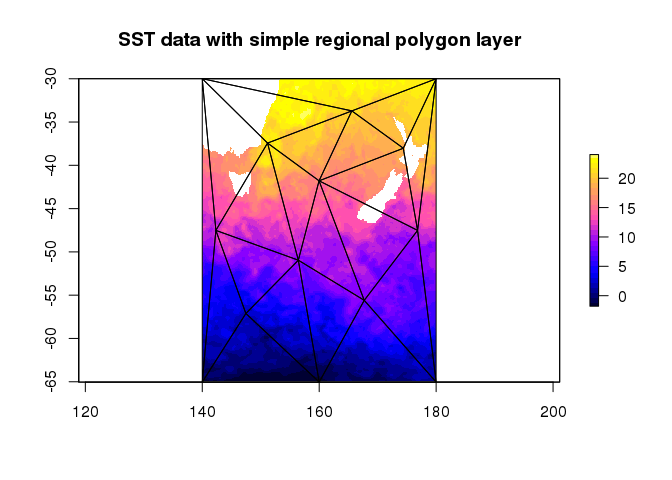
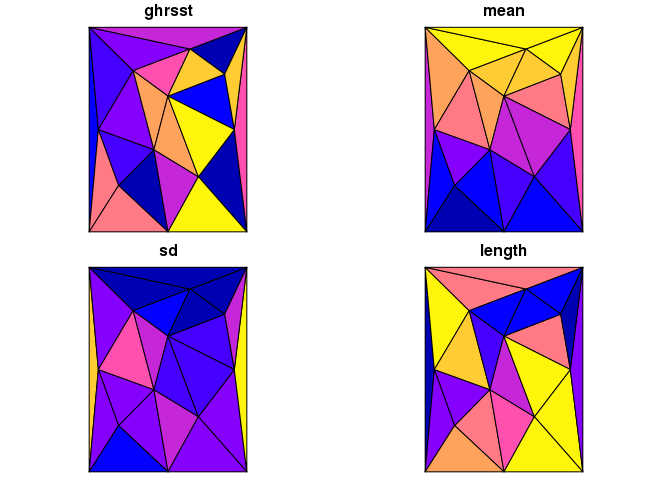
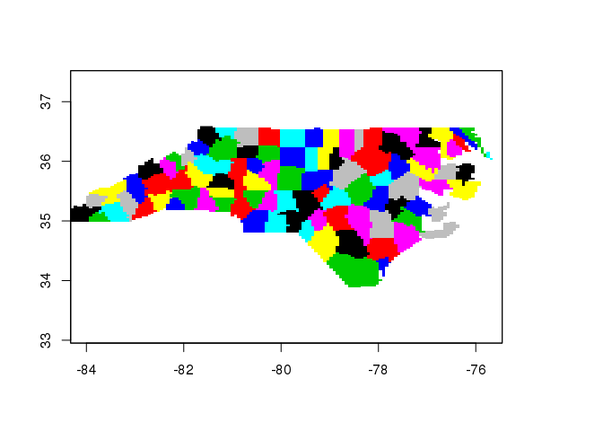
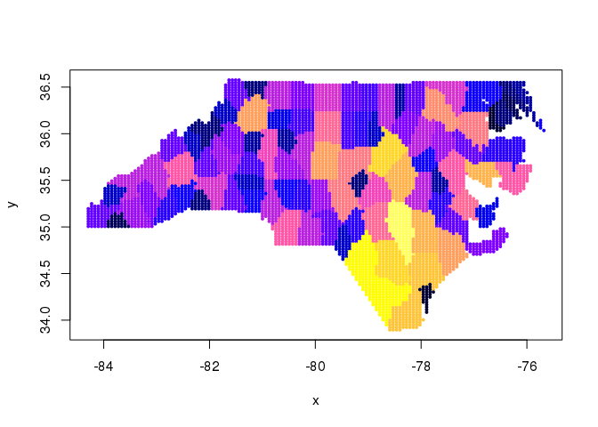

[](https://travis-ci.org/r-gris/tabularaster) [](https://ci.appveyor.com/project/r-gris/tabularaster) [](https://codecov.io/github/r-gris/tabularaster?branch=master)

<!-- README.md is generated from README.Rmd. Please edit that file -->
tabularaster
============

The `raster` package is extremely powerful in the R ecosystem for spatial data. It can be used very efficiently to drive data extraction and summary tools using its consistent cell-index and comprehensive helper functions for converting between cell values and less abstract raster grid properties.

Tabularaster provides some more helpers for working with cells and tries to fill some of the (very few!) gaps in raster functionality. When raster returns cell values of hierarchical objects it returns a hierarchical (list) of cells to match the input query.

Tabularaster provides:

-   extraction of cells as a simple data frame with "object ID" and "cell index"
-   workers to bring `sf` support to `raster`

There is some overlap with `quadmesh` and `spex` while I figure out where things belong.

Example
=======

This example uses extracted data per polygon and uses base R to `lapply` across the list of values extracted per polygon. Here we show a more `dplyrish` version after extracting the cell numbers with `tabularaster`.

``` r
library(tabularaster)
## https://gis.stackexchange.com/questions/102870/step-by-step-how-do-i-extract-raster-values-from-polygon-overlay-with-q-gis-or

library(raster)
#> Loading required package: sp

# Create integer class raster
r <- raster(ncol=36, nrow=18)
r[] <- round(runif(ncell(r),1,10),digits=0)

# Create two polygons
cds1 <- rbind(c(-180,-20), c(-160,5), c(-60, 0), c(-160,-60), c(-180,-20))
cds2 <- rbind(c(80,0), c(100,60), c(120,0), c(120,-55), c(80,0))
polys <- SpatialPolygonsDataFrame(SpatialPolygons(list(Polygons(list(Polygon(cds1)), 1), 
                                                       Polygons(list(Polygon(cds2)), 2))),data.frame(ID=c(1,2)))

## do extraction in abstract terms
(cn <- cellnumbers(r, polys))
#> Warning in cellnumbers(r, polys): projections not the same 
#>     x: +proj=longlat +datum=WGS84 +ellps=WGS84 +towgs84=0,0,0
#> query: NA
#> # A tibble: 63 x 2
#>    object_ cell_
#>      <chr> <dbl>
#>  1       1   326
#>  2       1   327
#>  3       1   328
#>  4       1   329
#>  5       1   330
#>  6       1   331
#>  7       1   332
#>  8       1   333
#>  9       1   334
#> 10       1   335
#> # ... with 53 more rows

library(dplyr)
#> 
#> Attaching package: 'dplyr'
#> The following objects are masked from 'package:raster':
#> 
#>     intersect, select, union
#> The following objects are masked from 'package:stats':
#> 
#>     filter, lag
#> The following objects are masked from 'package:base':
#> 
#>     intersect, setdiff, setequal, union
## now perform extraction for real
## and pipe into grouping by polygon (object_) and value, and
## calculate class percentage from class counts per polygon
cn %>% mutate(v = raster::extract(r, cell_)) %>% group_by(object_, v) %>% summarize(count = n()) %>% 
  mutate(v.pct = count / sum(count)) 
#> # A tibble: 18 x 4
#> # Groups:   object_ [2]
#>    object_     v count      v.pct
#>      <chr> <dbl> <int>      <dbl>
#>  1       1     1     1 0.02631579
#>  2       1     2     3 0.07894737
#>  3       1     3     5 0.13157895
#>  4       1     4     8 0.21052632
#>  5       1     5     2 0.05263158
#>  6       1     6     5 0.13157895
#>  7       1     7     4 0.10526316
#>  8       1     8     5 0.13157895
#>  9       1     9     5 0.13157895
#> 10       2     1     2 0.08000000
#> 11       2     2     1 0.04000000
#> 12       2     3     3 0.12000000
#> 13       2     4     3 0.12000000
#> 14       2     5     2 0.08000000
#> 15       2     6     4 0.16000000
#> 16       2     7     3 0.12000000
#> 17       2     8     4 0.16000000
#> 18       2     9     3 0.12000000
# Extract raster values to polygons                             
#( v <- extract(r, polys) )
# Get class counts for each polygon
#v.counts <- lapply(v,table)
# Calculate class percentages for each polygon
#( v.pct <- lapply(v.counts, FUN=function(x){ x / sum(x) } ) )
```

Extract cell numbers
====================

``` r
library(tabularaster)
data("ghrsst")  ## a RasterLayer
data("sst_regions") ## a polygon layer, contiguous with ghrsst

gcells <- cellnumbers(ghrsst, sst_regions) %>% mutate(object_ = as.integer(object_))

result <- gcells %>% mutate(sst = raster::extract(ghrsst, cell_)) %>% 
  group_by(object_) %>% 
  summarize_at(vars(sst), funs(mean(., na.rm = TRUE), sd(., na.rm = TRUE), length))

library(spdplyr)
sst_regions <- sst_regions %>% inner_join(result, c("ghrsst" = "object_"))

plot(ghrsst, col = bpy.colors(30), addfun = function() plot(sst_regions, add = TRUE), 
     main = "SST data with simple regional polygon layer")
```



``` r
library(sf)
#> Linking to GEOS 3.5.1, GDAL 2.1.2, proj.4 4.9.3
plot(st_as_sf(sst_regions))
```



Extract cells from rasters
==========================

``` r
library(tabularaster)
library(raster)
library(dplyr)
data("rastercano")
data("polycano")
cells <- cellnumbers(rastercano, polycano[4:5, ])
#> Warning in cellnumbers(rastercano, polycano[4:5, ]): projections not the same 
#>     x: NA
#> query: NA


cellnumbers(rastercano, as(polycano[4:5, ], "SpatialLinesDataFrame"))
#> Warning in cellnumbers(rastercano, as(polycano[4:5, ], "SpatialLinesDataFrame")): projections not the same 
#>     x: NA
#> query: NA
#> # A tibble: 235 x 2
#>    object_ cell_
#>      <chr> <dbl>
#>  1       1  1129
#>  2       1  1190
#>  3       1  1251
#>  4       2     1
#>  5       2     2
#>  6       2     3
#>  7       2     4
#>  8       2     5
#>  9       2     6
#> 10       2     7
#> # ... with 225 more rows
cellnumbers(rastercano, as(as(polycano[4:5, ], "SpatialLinesDataFrame"), "SpatialPointsDataFrame"))
#> Warning in cellnumbers(rastercano, as(as(polycano[4:5, ], "SpatialLinesDataFrame"), : projections not the same 
#>     x: NA
#> query: NA
#> # A tibble: 331 x 2
#>    object_ cell_
#>      <chr> <dbl>
#>  1       1  1129
#>  2       2  1129
#>  3       3  1251
#>  4       4  1251
#>  5       5  1129
#>  6       6  1098
#>  7       7  1098
#>  8       8  1098
#>  9       9  1098
#> 10      10  1037
#> # ... with 321 more rows

## weights not workin
#xweight <- cellnumbers(rastercano, polycano[4:5, ], weights = TRUE)
#xweight  %>% group_by(object_)  %>% summarize(sum(weight_))
```

Extract values or cell numbers with sf object
=============================================

It's an unfortunate symptom of fragmentation in the R spatial tools that two of the best and most highly used packages `raster` and `sf` have no formal way to be used together.

Here we use the `extent` capability of `spex`, and the tabularaster tools `extract` and `cellnumbers` to build a raster from an `sf` layer.

``` r
library(sf)

poly <- read_sf(system.file("shape/nc.shp", package="sf"))
library(spex)
extent(poly)
#> class       : Extent 
#> xmin        : -84.32385 
#> xmax        : -75.45698 
#> ymin        : 33.88199 
#> ymax        : 36.58965
spex(poly)
#> Warning in if (class(x) == "character") {: the condition has length > 1 and
#> only the first element will be used
#> Warning in if (class(x) != "CRS") {: the condition has length > 1 and only
#> the first element will be used
#> class       : SpatialPolygonsDataFrame 
#> features    : 1 
#> extent      : -84.32385, -75.45698, 33.88199, 36.58965  (xmin, xmax, ymin, ymax)
#> coord. ref. : NA 
#> variables   : 1
#> # A tibble: 1 x 1
#>    poly
#>   <int>
#> 1     1
## we can't do this
try(grid <-  raster(poly))

## but we can do 

(grid <- raster(spex(poly), nrow = 100, ncol = 140))
#> Warning in if (class(x) == "character") {: the condition has length > 1 and
#> only the first element will be used

#> Warning in if (class(x) == "character") {: the condition has length > 1 and
#> only the first element will be used
#> class       : RasterLayer 
#> dimensions  : 100, 140, 14000  (nrow, ncol, ncell)
#> resolution  : 0.06333482, 0.02707657  (x, y)
#> extent      : -84.32385, -75.45698, 33.88199, 36.58965  (xmin, xmax, ymin, ymax)
#> coord. ref. : NA

## index the raster with the sf layer
(cn <- cellnumbers(grid, poly))
#> Warning in cellnumbers(grid, poly): projections not the same 
#>     x: NA
#> query: +proj=longlat +datum=NAD27 +no_defs +ellps=clrk66 +nadgrids=@conus,@alaska,@ntv2_0.gsb,@ntv1_can.dat
#> # A tibble: 7,233 x 2
#>    object_ cell_
#>      <chr> <dbl>
#>  1       1    43
#>  2       1    44
#>  3       1    45
#>  4       1    46
#>  5       1   183
#>  6       1   184
#>  7       1   185
#>  8       1   186
#>  9       1   187
#> 10       1   322
#> # ... with 7,223 more rows

grid[cn$cell_] <- cn$object_

## we slasterized it (slow rasterize)
plot(grid)
```



That's nice, since we can actually use extract with the cell numbers, rather than the sf object. This is preferable for repeated use of the extraction, e.g. for time series extraction where we need to visit each time step iteratively. (Raster is already index-optimized for multi-layers raster objects).

Now use `fasterize` to generate the grid, and use cellnumbers to extract.

``` r
## fasterize it
library(fasterize)
#> 
#> Attaching package: 'fasterize'
#> The following object is masked from 'package:graphics':
#> 
#>     plot
#poly$object_ <- as.integer(seq_len(nrow(poly)))
fgrid <- fasterize(poly, grid, field = "AREA")
scl <- function(x) {rg <- range(x, na.rm = TRUE); (x   - rg[1])/diff(rg)}
plot(xyFromCell(grid, cn$cell_), pch = 19, cex = 0.4, col = bpy.colors(26)[scl(raster::extract(fgrid, cn$cell_)) * 25 + 1])
```


